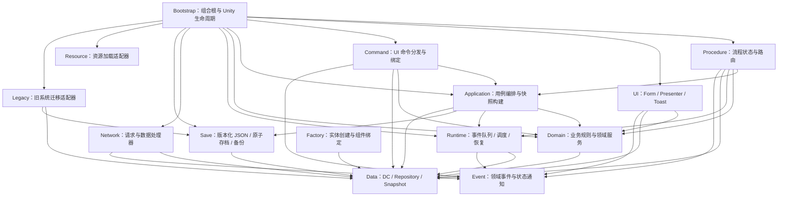
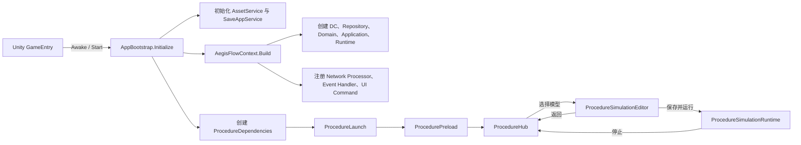
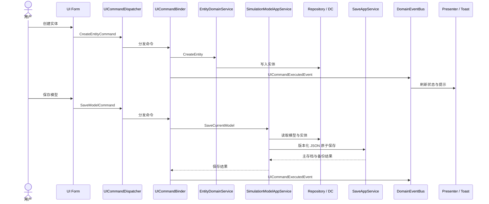
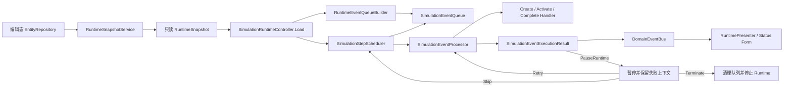

# AegisFlow 架构设计图

本文档以当前代码和 `asmdef` 为准，描述模块边界、启动流程、业务命令、存档和仿真运行链路。

## 1. 模块分层与依赖

边界规则：

- `Bootstrap` 是唯一组合根，可以依赖全部业务模块。
- `Procedure` 只能接收 `ProcedureDependencies`，不得反向引用 `Bootstrap/AegisFlowContext`。
- `UI` 只展示 ViewData、发送 Command 或订阅 Event，不直接修改 Repository。
- `Runtime` 只读取 `RuntimeSnapshot`，不直接读取编辑态 Repository。
- `Data` 与 `Event` 是底层叶子程序集，不依赖上层模块。

## 2. 启动与流程状态

## 3. 编辑、命令与存档流程

## 4. 仿真运行与故障恢复

运行时不变量：

- 固定步长由 `SimulationStepScheduler` 控制，并限制单帧追赶步数。
- Handler 异常必须转为结构化失败，不能逃逸到 Unity 主循环。
- 暂停恢复支持 Retry、Skip、Terminate，且不得重复推进当前 Step。
- Runtime 停止后必须清理 Snapshot、Queue、失败上下文和 `RuntimeDC`。

## 5. 全面测试覆盖地图

| 测试层级 | 覆盖模块 | 关键断言 |
|---|---|---|
| 架构规则 | asmdef、Bootstrap、Procedure、UI | 无循环依赖；Procedure 不引用 Bootstrap；UI 不写 Repository |
| 单元测试 | Data、Domain、Event、Save、Runtime、UI | 边界值、重复数据、事件解绑、JSON 版本、调度重入、Toast 生命周期 |
| 应用测试 | Application、Command、Network、Legacy、Factory | 用例编排、命令结果、协议注册、迁移幂等、实体恢复 |
| 集成测试 | Bootstrap、Procedure、Save、Runtime | 启动到 Hub；创建到保存再加载；快照到运行；失败恢复 |
| PlayMode 冒烟 | GameEntry、UI Form、Unity 生命周期 | 场景启动、点击命令、状态刷新、退出清理均无异常 |

推荐的最小端到端验收链：

```mermaid
flowchart LR
    start["启动 GameEntry"] --> hub["进入 Hub"]
    hub --> login["注入登录与玩家数据"]
    login --> editor["进入 Editor"]
    editor --> create["创建实体"]
    create --> save["保存模型"]
    save --> reload["清空并重新加载"]
    reload --> run["生成快照并启动 Runtime"]
    run --> steps["执行 Creating / Active / Complete"]
    steps --> verify["验证事件、状态和 Presenter"]
    verify --> stop["停止并校验资源清理"]
```

